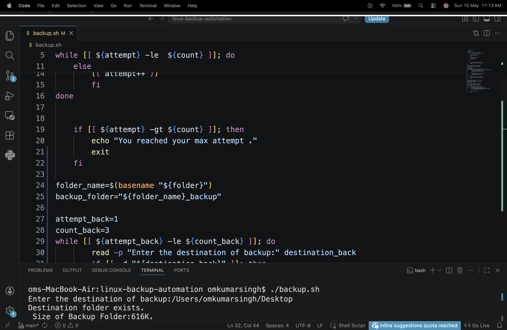
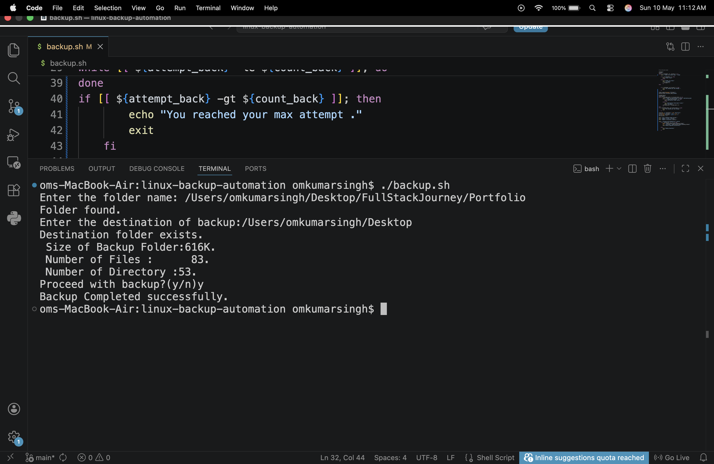
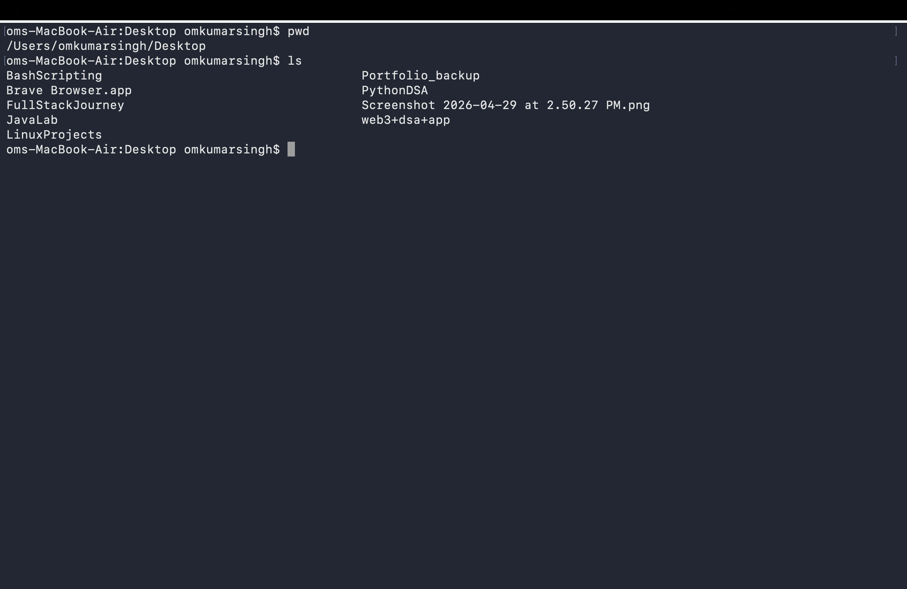

# Linux Backup Automation Tool

A Bash-based interactive backup automation script for Linux systems.

## Features
- Source folder validation with retry logic
- Destination folder validation
- Folder statistics (files, directories, size)
- Backup confirmation prompt
- Automated backup creation
- Recursive file copying

## Technologies Used
- Bash Scripting
- Linux CLI tools (`find`, `du`, `cp`, `basename`)

## How it works
1. User enters source folder
2. Script validates folder (max 3 attempts)
3. User enters backup destination
4. Script shows folder stats
5. User confirms backup
6. Backup is created automatically

##  Screenshots




## Usage
```bash
chmod +x backup.sh
./backup.sh